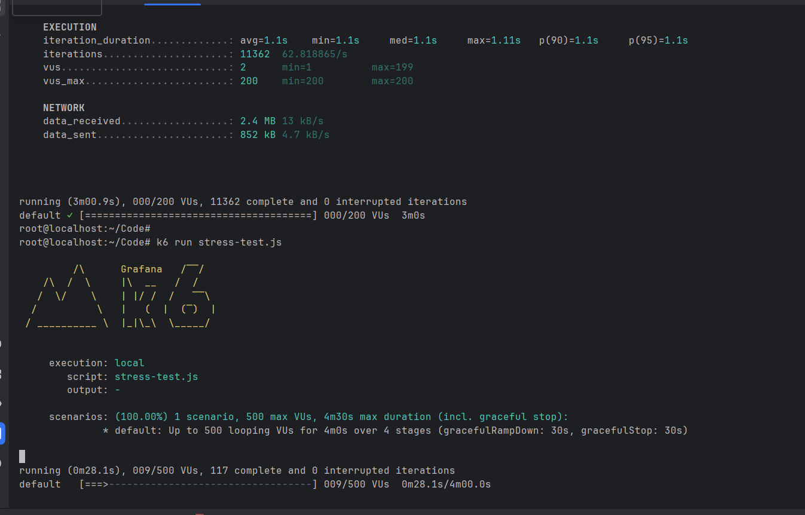

# 🚀 Kubernetes Observability & Stress Testing Lab


---

## 📌 Overview

This project demonstrates a complete **Monitoring & Observability setup on Kubernetes** using real workloads and stress testing.

It includes:

* Metrics (Prometheus)
* Visualization (Grafana)
* Logging (Loki + Alloy)
* Stress Testing
* Multiple Kubernetes workloads

---

## 🏗️ Architecture

<p align="center">
  
</p>

---

## ⚙️ Tech Stack

* Kubernetes (KIND)
* Docker
* Prometheus
* Grafana
* Loki
* Grafana Alloy
* Helm

---

## 📂 Project Structure

| File                         | Description              |
| ---------------------------- | ------------------------ |
| Deployment.yaml              | Stateless app deployment |
| service.yaml                 | NodePort service         |
| hpa.yaml                     | Auto scaling             |
| cronjob.yaml                 | Scheduled jobs           |
| job.yaml                     | One-time job             |
| daemonset.yaml               | Runs on all nodes        |
| statefulset.yaml             | Stateful workload        |
| pv.yaml / pvc.yaml           | Persistent storage       |
| role.yaml / rolebinding.yaml | RBAC                     |
| namespace.yaml               | Namespace setup          |
| Dockerfile                   | App container            |
| main.py                      | Dummy Flask app          |
| stress-test.js               | Load testing script      |

---

## 🎯 Use Cases

* Monitoring Kubernetes clusters
* Centralized logging
* Stress testing applications
* Auto-scaling validation
* Debugging real-world issues

---

## 📊 Grafana Dashboard

<p align="center">
  
</p>

---

## 📈 Prometheus Metrics (CPU Usage)

<p align="center">
  
</p>

---

## 🧪 Stress Testing (K6)

<p align="center">
  
</p>

---

## 🚀 Setup

### 1️⃣ Create Cluster

```bash id="g7f2xk"
kind create cluster
```

---

### 2️⃣ Add Helm Repos

```bash id="p2k9zc"
helm repo add prometheus-community https://prometheus-community.github.io/helm-charts
helm repo add grafana https://grafana.github.io/helm-charts
helm repo update
```

---

### 3️⃣ Create Namespace

```bash id="n4w8ts"
kubectl create namespace monitoring
```

---

### 4️⃣ Install Prometheus + Grafana

```bash id="h9q3bz"
helm install monitoring prometheus-community/kube-prometheus-stack -n monitoring
```

---

### 5️⃣ Install Loki

```bash id="4q2jzn"
helm install loki grafana/loki -n monitoring
```

---

### 6️⃣ Install Alloy

```bash id="h2v7xp"
helm install alloy grafana/alloy -n monitoring
```

---

### 7️⃣ Access Grafana

```bash id="y3m8cv"
kubectl port-forward svc/monitoring-grafana -n monitoring 3000:80
```

---

## 🐞 Issues Faced & Fixes

### ❌ Service not accessible

* Fixed using port forwarding + firewall rules

### ❌ Logs not showing

* Fixed Alloy configuration

### ❌ Metrics not available

* Fixed metrics-server

---

## 📚 Learnings

* Kubernetes networking
* Observability pipeline
* Debugging real-world issues
* Auto scaling with HPA

---

## 🔮 Future Improvements

* Add Jaeger (Tracing)
* Add EFK stack
* Setup alerts

---

## 🤝 Conclusion

This project demonstrates a real-world **DevOps observability pipeline** with monitoring, logging, stress testing, and debugging.

